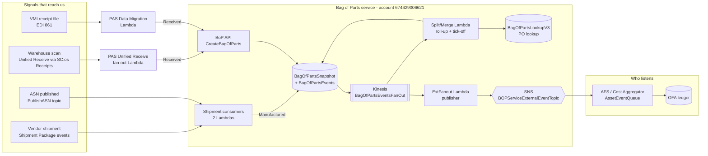
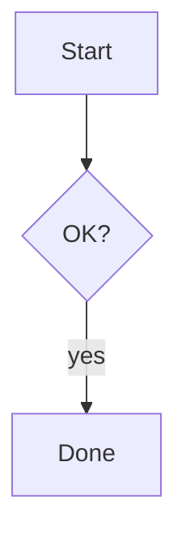

# AWS fixture

## Bag of Parts flow

```mermaid
flowchart LR
  subgraph IN[Signals that reach us]
    A1[Vendor shipment<br/>Shipment Package events] 
    A2[ASN published<br/>PublishASN topic]
    B1[Warehouse scan<br/>Unified Receive via SC.os Receipts]
    C1[VMI receipt file<br/>EDI 861]
  end
  subgraph BOP[Bag of Parts service - account 674429006621]
    S1[Shipment consumers<br/>2 Lambdas]
    API[BoP API<br/>CreateBagOfParts]
    DB[(BagOfPartsSnapshot<br/>+ BagOfPartsEvents)]
    K[[Kinesis<br/>BagOfPartsEventsFanOut]]
    SM[Split/Merge Lambda<br/>roll-up + tick-off]
    LK[(BagOfPartsLookupV3<br/>PO lookup)]
    PUB[ExtFanout Lambda<br/>publisher]
    T{{SNS<br/>BOPServiceExternalEventTopic}}
  end
  subgraph OUT[Who listens]
    AFS[AFS / Cost Aggregator<br/>AssetEventQueue]
    OFA[(OFA ledger)]
  end
  A1 --> S1
  A2 --> S1
  S1 -->|Manufactured| DB
  B1 --> P1[PAS Unified Receive<br/>fan-out Lambda] -->|Received| API
  C1 --> P2[PAS Data Migration<br/>Lambda] -->|Received| API
  API --> DB
  DB --> K
  K --> SM
  SM --> DB
  SM --> LK
  K --> PUB --> T --> AFS --> OFA
```

## Plain flow

```mermaid
flowchart TD
  A[Start] --> B{OK?}
  B -->|yes| C[Done]
```
