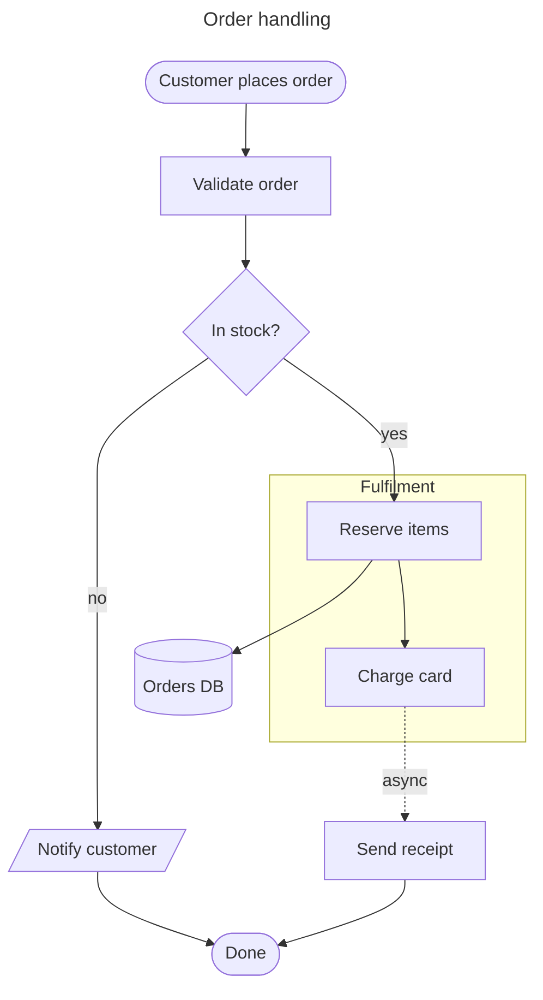
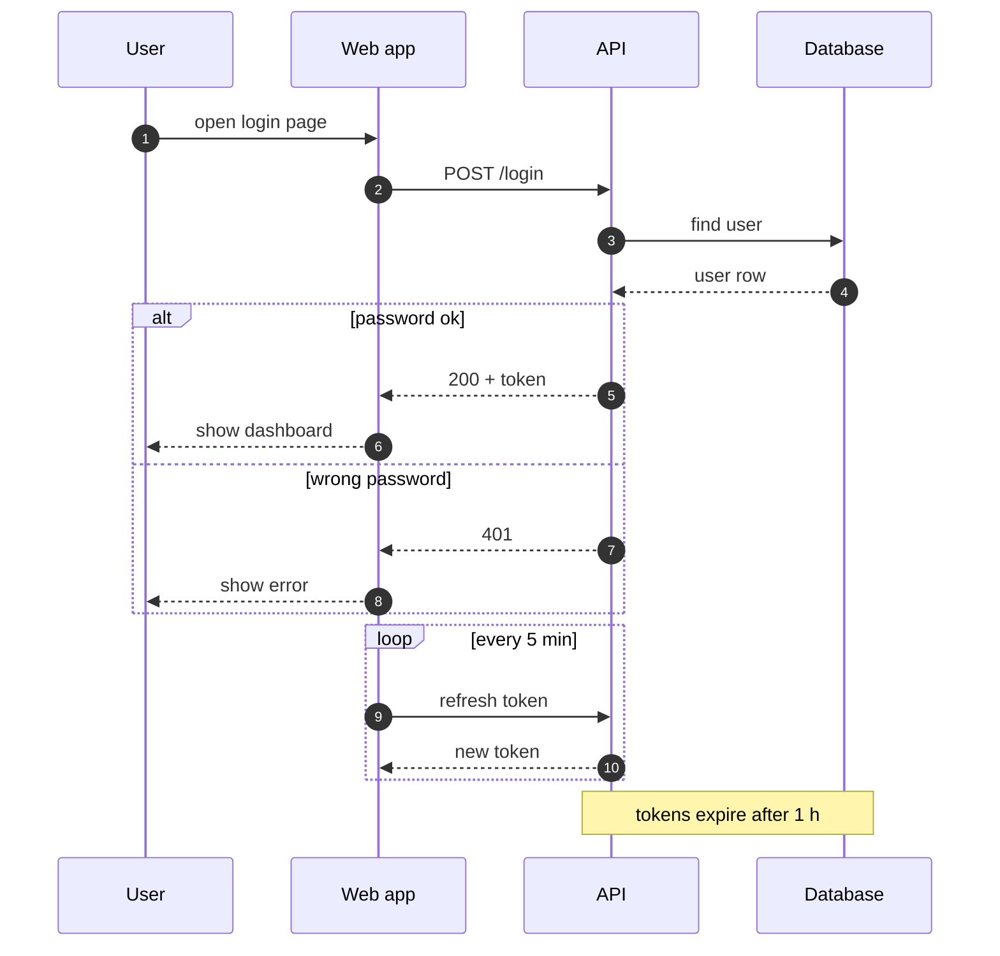
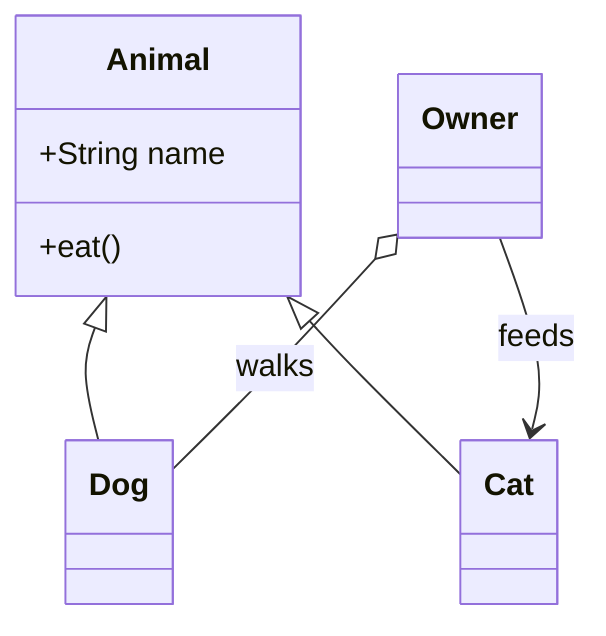
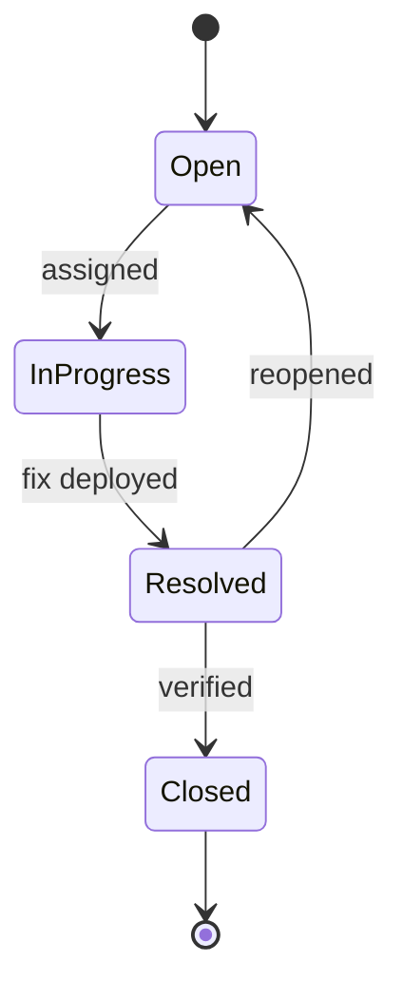
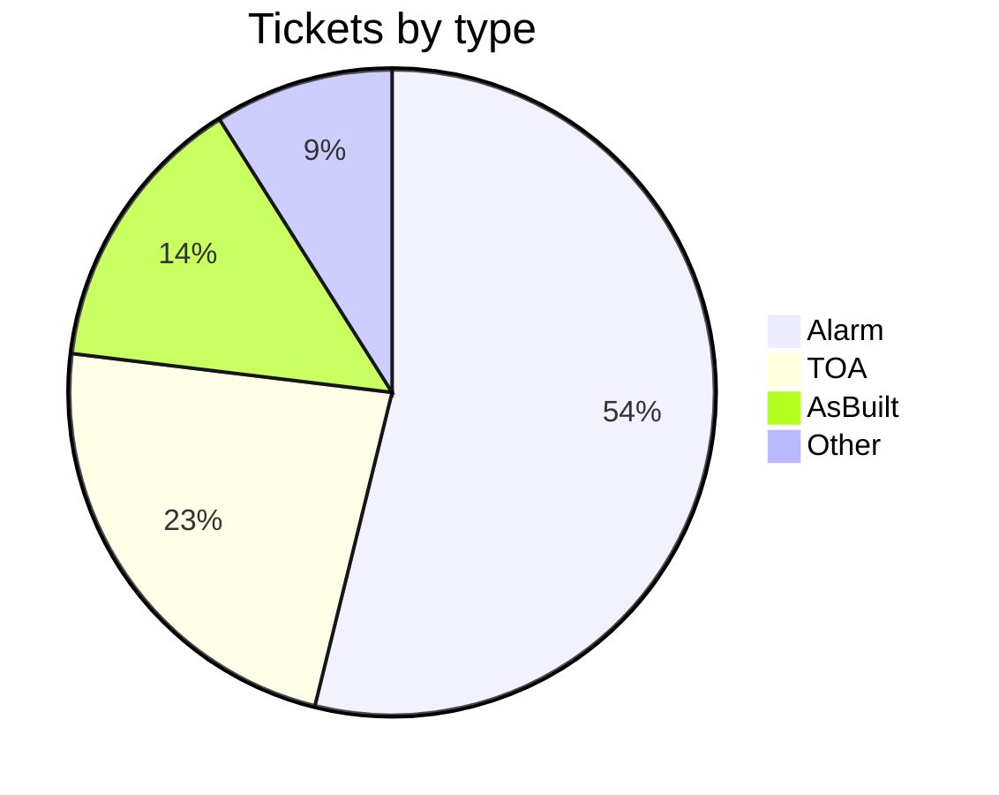
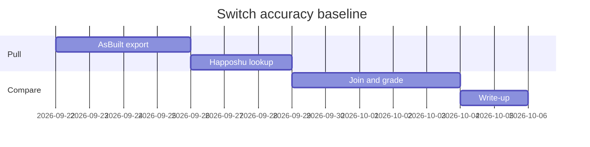

# Diagrams fixture

Used by `test/diagram-test.mjs`. One of each common kind, a broken one, and an untagged fence that starts with a diagram word.

## Order flow



## Login sequence



## Classes



## Ticket states



## Share of tickets



## Plan



## Untagged

```
flowchart LR
    S[Start] --> T[Finish]
```

## Broken on purpose

```mermaid
flowchart LR
    A[Start] --> B[Middle
    B --> C[End]
```

Closing paragraph after the diagrams.
